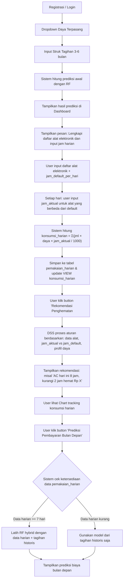

# Tugas Akhir / Skripsi : Sistem Analisis Konsumsi dan Prediksi Biaya Listrik Rumah Tangga untuk Optimalisasi Penghematan Energi dengan Model Random Forest
# Sistem Analisis Konsumsi & Prediksi Biaya Listrik

## Deskripsi
Aplikasi web untuk membantu rumah tangga memprediksi biaya listrik dan mendapatkan rekomendasi penghematan energi. metode: Random Forest + Decision Support System.

## Tujuan Sistem
1. Memprediksi biaya listrik bulan depan berdasarkan data historis tagihan (3-6 bulan) dan data konsumsi harian (opsional).
2. Menganalisis pola konsumsi listrik melalui grafik harian.
3. Memberikan rekomendasi penghematan energi secara personal menggunakan Decision Support System (DSS) berbasis aturan.

### Perbedaan Role
| Role       | Hak Akses                                                                                                                                                                      |
| ---------- | ------------------------------------------------------------------------------------------------------------------------------------------------------------------------------ |
| `admin`    | Mengelola user, mengubah role user, mengelola tarif listrik, melihat statistik global, mengelola aturan DSS, retrain model Random Forest, menjalankan fitur admin lainnya dan menggunakan fitur yang digunakan end user juga |
| `end_user` | Menggunakan fitur utama sistem seperti input tagihan, input alat elektronik, input pemakaian harian, melihat prediksi, dashboard, rekomendasi, dan export laporan.             |

### Default Role

Saat user melakukan registrasi mandiri, role otomatis menjadi:

```text
end_user
```

Admin dapat mengubah role user melalui fitur kelola user.

## Teknologi
1. Prediksi : Random Forest Regressor (dari scikit-learn)
2. Rekomendasi : Decision Support System (rule-based / if-then)
3. Backend : Python Flask (menyediakan REST API), SQL Server (gunakan stored procedure / function di sql server jika diperlukan), scikit-learn, pandas, joblib
4.  Frontend: React.js v18, Chart.js, Axios (dashboard, chart, form input)
- Deployment: Backend di Render atau local, Frontend di Vercel, Database SQL Server local (demo)

## Struktur Proyek
```text
backend/
├── app.py
├── models/
│ └── rf_model.pkl
├── routes/
│ ├── auth.py
│ ├── tagihan.py
│ ├── alat.py
│ ├── pemakaian.py # untuk input jam harian per alat
│ ├── prediksi.py
│ └── rekomendasi.py
├── utils/
│ ├── db_conn.py
│ ├── rf_train.py
│ └── rules_dss.py
└── requirements.txt

frontend/
├── src/
│ ├── components/
│ │ ├── Login.js
│ │ ├── Dashboard.js
│ │ ├── InputTagihan.js
│ │ ├── InputAlatBulk.js
│ │ ├── InputPemakaianHarian.js # ganti dari InputHarian.js
│ │ ├── ChartListrik.js
│ │ └── RekomendasiList.js
│ ├── App.js
│ └── index.js
└── package.json
```

## Cara Menjalankan Backend
```bash
cd backend
pip install -r requirements.txt
python app.py
```
## Cara Menjalankan Frontend
```bash
cd frontend
npm installr
npm start
```

## Alur Utama Sistem
- Registrasi → pilih daya
- Input tagihan 3-6 bulan → sistem tampilkan prediksi awal
- (Opsional)  Input daftar alat elektronik + jam_default_per_hari
- (Opsional) Setiap hari: user input jam aktual pemakaian untuk alat yang berbeda dari default (sistem hitung kWh otomatis)
- Klik "Rekomendasi" → DSS memberikan saran hemat energi
- Klik "Prediksi bulan Depan" → model hybrid hitung ulang prediksi

### Catatan Implementasi
- Model Random Forest awal dilatih dengan data sintetis atau dataset publik (Mendeley/Kaggle) yang merepresentasikan pola konsumsi rumah tangga. Model akan di‑fine-tune dengan data riil pengguna jika data harian sudah cukup (≥ 30 hari).
- DSS menggunakan aturan if-then yang dapat diperluas.
- Perhitungan konsumsi harian dilakukan otomatis oleh backend:

```bash
kWh_alat = jumlah × daya_watt × jam_aktual / 1000
total_kWh_hari = Σ(kWh_alat) dari semua alat yang digunakan pada tanggal tersebut
```
- Perhitungan biaya listrik:
```bash
tarif = SELECT tarif_per_kwh FROM tarif_listrik 
        WHERE daya_va = [daya_user] 
          AND berlaku_dari <= [tanggal_pemakaian]
          AND (berlaku_sampai >= [tanggal_pemakaian] OR berlaku_sampai IS NULL)
biaya_hari = total_kWh_hari × tarif
biaya_bulan = Σ(biaya_hari selama 30 hari) + biaya_tambahan (misal 5000)
```
- Tarif per kWh : (Hal ini bisa disesuaikan oleh admin, jadi data ini diambil dari tabel database saja)
a. 450 VA: Rp 415/kWh (subsidi) atau jika non-subsidi Rp 1.352?
b. 900 VA: Rp 1.352/kWh
c. 1300 VA: Rp 1.444,70/kWh
d. 2200 VA: Rp 1.444,70/kWh
(Sesuaikan dengan data terbaru saat implementasi)


---

## Alur Flowchart



## Rancangan Table
```bash
-- 1. Tabel users
CREATE TABLE users (
    user_id INT IDENTITY(1,1) PRIMARY KEY,
    username NVARCHAR(50) NOT NULL UNIQUE,
    password_hash NVARCHAR(255) NOT NULL,
    email NVARCHAR(100),
    role NVARCHAR(100),
    daya_terpasang INT NOT NULL, -- dalam VA (450,900,1300,2200)
    jumlah_penghuni INT,
    created_at DATETIME DEFAULT GETDATE()
);

-- 1b. Tabel tarif_listrik (dikelola admin)
CREATE TABLE tarif_listrik (
    tarif_id INT IDENTITY(1,1) PRIMARY KEY,
    daya_va INT NOT NULL,
    tarif_per_kwh DECIMAL(12,2) NOT NULL,
    berlaku_dari DATE NOT NULL,
    berlaku_sampai DATE NULL,
    created_at DATETIME DEFAULT GETDATE(),
    updated_at DATETIME DEFAULT GETDATE()
);

-- ... lanjut ke tabel tagihan, alat_elektronik, dst.

-- 2. Tabel tagihan (struk pembayaran bulanan)
CREATE TABLE tagihan (
    tagihan_id INT IDENTITY(1,1) PRIMARY KEY,
    user_id INT FOREIGN KEY REFERENCES users(user_id),
    bulan INT NOT NULL, -- 1-12
    tahun INT NOT NULL,
    konsumsi_kWh DECIMAL(10,2) NOT NULL, -- dari struk atau dihitung dari biaya
    biaya DECIMAL(15,2), -- opsional, bisa diisi atau dihitung
    CONSTRAINT CHK_Bulan_Tahun UNIQUE(user_id, bulan, tahun)
);

-- 3. Tabel alat_elektronik (input bulk)
CREATE TABLE alat_elektronik (
    alat_id INT IDENTITY(1,1) PRIMARY KEY,
    user_id INT FOREIGN KEY REFERENCES users(user_id),
    nama_alat NVARCHAR(100) NOT NULL,
    jumlah INT NOT NULL DEFAULT 1,
    daya_watt INT NOT NULL, -- daya per unit (Watt)
    jam_default_per_hari DECIMAL(5,2) NOT NULL, -- rata-rata pemakaian jam/hari (default)
    created_at DATETIME DEFAULT GETDATE()
);

-- 4. Tabel pemakaian_harian (input jam aktual per alat per hari)
CREATE TABLE pemakaian_harian (
    pemakaian_id INT IDENTITY(1,1) PRIMARY KEY,
    user_id INT FOREIGN KEY REFERENCES users(user_id),
    alat_id INT FOREIGN KEY REFERENCES alat_elektronik(alat_id),
    tanggal DATE NOT NULL,
    jam_aktual DECIMAL(5,2) NOT NULL, -- jam pemakaian alat pada hari itu
    CONSTRAINT CHK_unik_pemakaian UNIQUE(user_id, alat_id, tanggal)
);

-- 5. VIEW v_konsumsi_harian (menghitung kWh otomatis dari pemakaian_harian)
CREATE VIEW v_konsumsi_harian AS
SELECT 
    ph.user_id,
    ph.tanggal,
    SUM(ae.jumlah * ae.daya_watt * ph.jam_aktual / 1000.0) AS konsumsi_kWh
FROM pemakaian_harian ph
JOIN alat_elektronik ae ON ph.alat_id = ae.alat_id
GROUP BY ph.user_id, ph.tanggal;

-- 6. Tabel prediksi (menyimpan hasil prediksi untuk riwayat)
CREATE TABLE prediksi (
    prediksi_id INT IDENTITY(1,1) PRIMARY KEY,
    user_id INT FOREIGN KEY REFERENCES users(user_id),
    bulan_target INT NOT NULL,
    tahun_target INT NOT NULL,
    prediksi_kWh DECIMAL(10,2) NOT NULL,
    metode NVARCHAR(50), -- 'hanya_tagihan' atau 'hybrid_harian'
    created_at DATETIME DEFAULT GETDATE()
);

-- 7. Tabel rekomendasi (menyimpan rekomendasi yang pernah diberikan)
CREATE TABLE rekomendasi (
    rekomendasi_id INT IDENTITY(1,1) PRIMARY KEY,
    user_id INT FOREIGN KEY REFERENCES users(user_id),
    teks_rekomendasi NVARCHAR(500) NOT NULL,
    tanggal DATETIME DEFAULT GETDATE(),
    sudah_diterapkan BIT DEFAULT 0
);

```

## Daftar Fitur Lengkap

---

## 1. Modul Autentikasi & Profil

| No  | Fitur                  | Deskripsi                                                                 | Prioritas |
|-----|------------------------|---------------------------------------------------------------------------|-----------|
| 1.1 | Registrasi Akun        | User membuat akun baru dengan username, email, password                   | Wajib     |
| 1.2 | Login                  | User masuk ke sistem menggunakan kredensial                               | Wajib     |
| 1.3 | Pilih Daya Terpasang   | Dropdown daya (450, 900, 1300, 2200, 3500 VA) saat registrasi             | Wajib     |
| 1.4 | Input Jumlah Penghuni  | User mengisi berapa orang tinggal dalam rumah                             | Wajib     |
| 1.5 | Edit Profil            | User dapat mengubah data profil (daya, jumlah penghuni, email, password)  | Opsional  |

---

## 2. Modul Input Data Historis (Struk Tagihan)

| No  | Fitur                   | Deskripsi                                                                                        | Prioritas |
|-----|-------------------------|--------------------------------------------------------------------------------------------------|-----------|
| 2.1 | Input Tagihan Per bulan | Form input: bulan, tahun, biaya (Rp) atau konsumsi (kWh)                                        | Wajib     |
| 2.2 | Tambah Baris Tagihan    | User bisa menambah baris input secara dinamis (minimal 3, maksimal 6 bulan)                      | Wajib     |
| 2.3 | Hapus Baris Tagihan     | User bisa menghapus baris input yang tidak diperlukan                                            | Wajib     |
| 2.4 | Validasi bulan Unik     | Sistem melarang input bulan dan tahun yang sama dua kali                                         | Wajib     |
| 2.5 | Konversi Biaya ke kWh   | Jika user input biaya, sistem otomatis hitung kWh (biaya ÷ tarif per kWh sesuai daya)            | Wajib     |
| 2.6 | Edit Tagihan            | User dapat mengedit data tagihan yang sudah diinput                                              | Opsional  |
| 2.7 | Hapus Tagihan           | User dapat menghapus riwayat tagihan tertentu                                                    | Opsional  |
| 2.8 | Lihat Riwayat Tagihan   | Tabel menampilkan semua tagihan yang sudah diinput per user                                      | Opsional  |

---

## 3. Modul Prediksi Biaya Listrik

| No  | Fitur                        | Deskripsi                                                                                                         | Prioritas |
|-----|------------------------------|-------------------------------------------------------------------------------------------------------------------|-----------|
| 3.1 | Prediksi Awal (Post-Tagihan) | Setelah input 3–6 tagihan, sistem langsung tampilkan prediksi bulan depan                                         | Wajib     |
| 3.2 | Tampilkan Hasil Prediksi     | Format: "Berdasarkan tagihan [daftar bulan], prediksi [bulan target]: X kWh, estimasi Rp Y"                       | Wajib     |
| 3.3 | Prediksi Ulang (Hybrid)      | Button "Prediksi bulan Depan" — menggabungkan data tagihan + data harian (jika ada)                               | Wajib     |
| 3.4 | Indikator metode Prediksi    | Sistem menampilkan apakah prediksi dari "hanya tagihan" atau "hybrid (tagihan + harian)"                          | Wajib     |
| 3.5 | Riwayat Prediksi             | Tabel menampilkan semua prediksi yang pernah dihasilkan per user                                                  | Opsional  |
| 3.6 | Simpan Hasil Prediksi        | Sistem menyimpan setiap hasil prediksi ke database (tabel Prediksi)                                               | Wajib     |

---

## 4. Modul Input Alat Elektronik (Bulk Mode)

| No  | Fitur                          | Deskripsi                                                                                       | Prioritas |
|-----|--------------------------------|-------------------------------------------------------------------------------------------------|-----------|
| 4.1 | Input Bulk Alat Elektronik     | Tabel dengan kolom: Nama Alat, Jumlah, Daya (Watt), Jam/Hari. User bisa tambah beberapa baris  | Wajib     |
| 4.2 | Tambah Baris Alat              | Button "+ Tambah Alat" untuk menambah baris baru di tabel                                       | Wajib     |
| 4.3 | Hapus Baris Alat               | Button "Hapus" per baris untuk menghapus alat dari daftar input                                 | Wajib     |
| 4.4 | Submit Multiple Alat           | Satu kali submit untuk menyimpan semua alat elektronik ke database                              | Wajib     |
| 4.5 | Edit Daftar Alat               | User dapat mengedit alat elektronik yang sudah tersimpan                                        | Opsional  |
| 4.6 | Hapus Alat                     | User dapat menghapus satu alat dari daftar                                                      | Opsional  |
| 4.7 | Lihat Daftar Alat              | Tabel menampilkan semua alat elektronik yang sudah tersimpan                                    | Opsional  |
| 4.8 | Hitung Estimasi Konsumsi Teoritis | Sistem hitung estimasi kWh/hari dari alat: Σ(jumlah × daya × jam ÷ 1000)                    | Opsional  |

---

## 5. Modul Input Pemakaian Harian (Jam Aktual per Alat)

| No  | Fitur                              | Deskripsi                                                                                                                              | Prioritas |
|-----|------------------------------------|----------------------------------------------------------------------------------------------------------------------------------------|-----------|
| 5.1 | Input Pemakaian Harian per Alat    | User pilih tanggal, lalu untuk setiap alat elektronik yang dimiliki, sistem menampilkan input field untuk mengisi **jam pemakaian aktual** pada hari itu. Nilai default diisi dari `jam_default_per_hari`. User cukup mengubah jika berbeda. Sistem otomatis menghitung konsumsi kWh. | Wajib     |
| 5.2 | Input untuk Tanggal Kemarin/Hari Ini | User bisa input untuk tanggal yang sudah lewat (tidak hanya hari ini)                                                        | Wajib     |
| 5.3 | Validasi Tanggal Unik per Alat     | Sistem tidak mengizinkan input dua kali untuk kombinasi (user, alat, tanggal) yang sama                                               | Wajib     |
| 5.4 | Edit Pemakaian Harian              | User dapat mengubah jam_aktual pada tanggal dan alat tertentu                                                                          | Opsional  |
| 5.5 | Hapus Pemakaian Harian             | User dapat menghapus data pemakaian pada tanggal dan alat tertentu                                                                     | Opsional  |
| 5.6 | Lihat Riwayat Pemakaian            | Tabel menampilkan semua data pemakaian harian per alat yang sudah diinput                                                              | Opsional  |
| 5.7 | Pesan Ajakan Input Harian          | Sistem menampilkan pesan: "Lengkapi data pemakaian harian untuk mendapatkan rekomendasi pengoptimalan yang lebih akurat!"              | Wajib     |
---

## 6. Modul Dashboard & Visualisasi

| No  | Fitur                            | Deskripsi                                                                                    | Prioritas |
|-----|----------------------------------|----------------------------------------------------------------------------------------------|-----------|
| 6.1 | Line Chart Konsumsi Harian       | Grafik garis menampilkan konsumsi harian (30 hari terakhir atau semua data)                  | Wajib     |
| 6.2 | Bar Chart Perbandingan Hari      | Grafik batang: rata-rata konsumsi Senin vs Selasa vs ... vs Minggu                           | Wajib     |
| 6.3 | Kartu Info Ringkasan             | Menampilkan: rata-rata konsumsi harian, total bulan ini, perkiraan tagihan bulan ini         | Wajib     |
| 6.4 | Tampilkan Prediksi Terbaru       | Di dashboard, tampilkan prediksi bulan depan yang paling baru                                | Wajib     |
| 6.5 | Gauge Sisa Kuota Daya (Opsional) | Indikator visual perkiraan persentase penggunaan dari daya terpasang                         | Opsional  |
| 6.6 | Tooltip Interaktif               | Hover pada chart menampilkan nilai detail                                                    | Opsional  |

---

## 7. Modul Rekomendasi Penghematan (DSS)

| No  | Fitur                                  | Deskripsi                                                                                                           | Prioritas |
|-----|----------------------------------------|---------------------------------------------------------------------------------------------------------------------|-----------|
| 7.1 | Button "Dapatkan Rekomendasi"          | User klik untuk memicu DSS memproses rekomendasi                                                                    | Wajib     |
| 7.2 | Rekomendasi Berdasarkan Alat           | Jika alat elektronik ada, DSS beri saran spesifik (contoh: "AC 500W nyala 10 jam, kurangi 2 jam hemat Rp X")        | Wajib     |
| 7.3 | Rekomendasi Berdasarkan Konsumsi Harian | Jika data harian ada, deteksi pola boros (misal: "Konsumsi Sabtu-Minggu lebih tinggi 30%")                         | Wajib     |
| 7.4 | Rekomendasi Berdasarkan Profil Daya    | Aturan umum berdasarkan daya terpasang (contoh: untuk 450VA, "hindari menyalakan setrika dan pompa air bersamaan")  | Wajib     |
| 7.5 | Rekomendasi Berdasarkan Benchmarking   | Bandingkan konsumsi user dengan rata-rata rumah tangga sejenis (jika data referensi ada)                            | Opsional  |
| 7.6 | Estimasi Potensi Hemat                 | Setiap rekomendasi disertai estimasi Rp yang bisa dihemat per bulan                                                 | Opsional  |
| 7.7 | Tandai Rekomendasi Sudah Diterapkan    | User bisa checklist rekomendasi yang sudah dilakukan                                                                | Opsional  |
| 7.8 | Riwayat Rekomendasi                    | Tabel menampilkan semua rekomendasi yang pernah diberikan ke user                                                   | Opsional  |
| 7.9 | Simpan Rekomendasi ke Database         | Setiap rekomendasi yang dihasilkan disimpan di tabel Rekomendasi                                                    | Wajib     |

---

## 8. Modul Aturan Decision Support System (DSS)

| No  | Aturan                                        | Kondisi                                                                   | Rekomendasi                                                                                                                          |
|-----|-----------------------------------------------|---------------------------------------------------------------------------|--------------------------------------------------------------------------------------------------------------------------------------|
| R1  | Daya kecil (450–900 VA)                       | Daya ≤ 900 VA                                                             | "Hindari menggunakan perangkat tinggi watt (setrika, dispenser, magicom) secara bersamaan untuk mencegah mati listrik."              |
| R2  | Daya besar                                    | Daya ≥ 1300 VA                                                            | "Pertimbangkan untuk mengganti AC dan kulkas dengan varian inverter yang lebih hemat energi."                                        |
| R3  | Konsumsi melebihi rata-rata                   | Konsumsi per orang > 120 kWh/bulan                                        | "Konsumsi Anda di atas rata-rata rumah tangga sejenis. Lakukan audit peralatan listrik."                                             |
| R4  | AC boros (berdasarkan input alat)             | Ada AC dengan daya > 500W dan jam/hari > 8                                | "AC Anda menyala lebih dari 8 jam sehari. Coba gunakan timer 6 jam dan set suhu 24°C."                                               |
| R5  | Kulkas boros                                  | Ada kulkas dengan tahun pembuatan > 10 tahun (jika user input)            | "Kulkas lama mengonsumsi 2x lipat lebih banyak. Pertimbangkan untuk mengganti yang baru."                                            |
| R6  | Lonjakan konsumsi (berdasarkan data harian)   | Konsumsi hari ini > 1.5x rata-rata 7 hari terakhir                        | "Ada lonjakan konsumsi hari ini. Cek apakah ada perangkat yang lupa dimatikan."                                                      |
| R7  | Akhir pekan boros (berdasarkan data harian)   | Rata-rata Sabtu-Minggu > 1.3x rata-rata Senin-Jumat                       | "Konsumsi akhir pekan lebih tinggi. Coba kurangi penggunaan TV dan gaming di hari libur."                                            |
| R8  | Risiko melebihi daya                          | Konsumsi puncak (estimasi) > 0.9 × Daya × 220 / 1000                     | "Anda berisiko melebihi daya terpasang. Hindari menyalakan banyak perangkat bersamaan."                                              |
| R9  | Pencahayaan                                   | Input alat: jumlah lampu > 5 dan daya per lampu > 15W                     | "Ganti lampu Anda ke LED 5–10W untuk menghemat hingga 70% biaya pencahayaan."                                                        |
| R10 | Standby power                                 | Aturan default jika tidak ada data spesifik                               | "Cabut charger, TV, dan perangkat elektronik lain saat tidak digunakan. Perangkat standby mengonsumsi 5–10% dari total listrik."      |

---

## 9. Modul Laporan & Export

| No  | Fitur                      | Deskripsi                                                                                     | Prioritas |
|-----|----------------------------|-----------------------------------------------------------------------------------------------|-----------|
| 9.1 | Export Data Konsumsi ke CSV | User bisa download riwayat konsumsi harian dalam format CSV                                  | Wajib  |
| 9.2 | Export Laporan Bulanan     | Generate laporan PDF berisi ringkasan konsumsi, prediksi, dan rekomendasi bulan tersebut      | Wajib  |
| 9.3 | Print Dashboard            | User bisa mencetak halaman dashboard sebagai laporan fisik                                    | Wajib  |

---

## 10. Modul Admin (Opsional)

| No   | Fitur                  | Deskripsi                                                                        | Prioritas |
|------|------------------------|----------------------------------------------------------------------------------|-----------|
| 10.1 | Login Admin            | Akun khusus admin untuk mengelola sistem                                         | Wajib     |
| 10.2 | Kelola Tarif Listrik   | Admin dapat menambah, mengedit, menghapus tarif per kWh berdasarkan daya VA dan periode berlaku. Sistem akan menggunakan tarif terbaru untuk perhitungan biaya. | Wajib     |
| 10.3 | Lihat Semua User       | Admin dapat melihat daftar seluruh user yang terdaftar                           | Wajib  |
| 10.4 | Lihat Statistik Global | Grafik agregat konsumsi semua user untuk analisis                                | Wajib  |
| 10.5 | Kelola Aturan DSS      | Admin dapat menambah/mengedit/menghapus aturan rekomendasi                       | Wajib  |
| 10.6 | Retrain Model RF       | Admin bisa memicu ulang pelatihan model Random Forest dengan data terbaru        | Wajib  |

## 🏷️ Keterangan Prioritas

| Prioritas | Arti                                                               | Target Pengerjaan         |
|-----------|--------------------------------------------------------------------|---------------------------|
| Wajib     | Fitur inti yang harus ada agar sistem sesuai judul TA              | Selesai 100%              |
| Opsional  | Fitur tambahan jika waktu memungkinkan, untuk nilai lebih           | Selesai jika ada waktu    |

---

